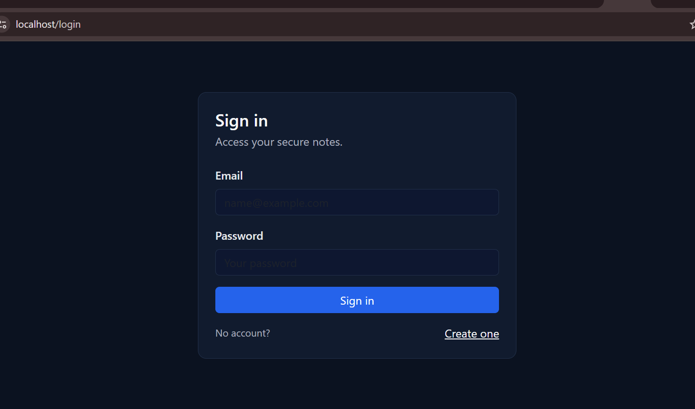
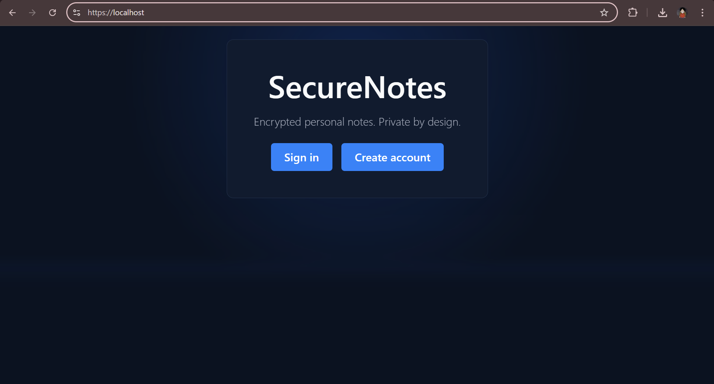
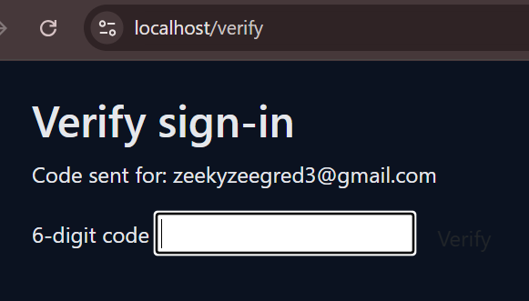
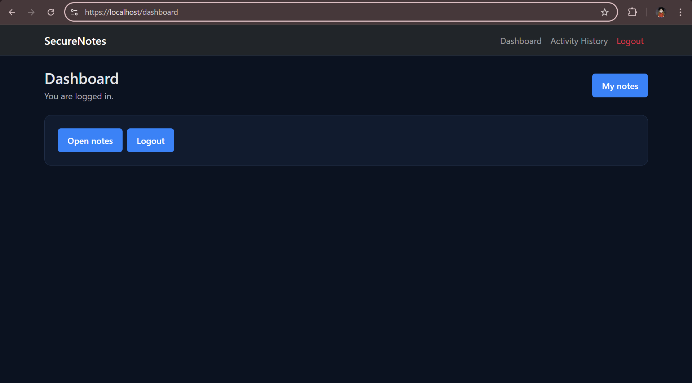
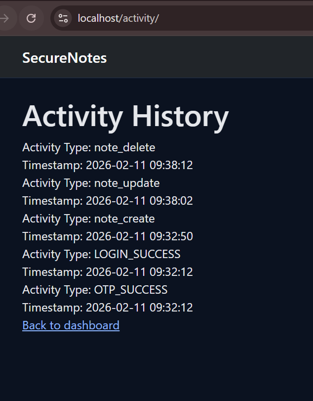

# SecureNotes

> Encrypted personal notes. Private by design.

A full-stack web application built with Flask and MySQL that lets users securely register, log in, and manage personal notes. Built as a Final Year Project for a BSc (Hons) in Cyber Security, with a focus on applying real-world security practices throughout.



---

## Features

- **User registration & login** — email and password authentication
- **Two-factor authentication (2FA)** — a 6-digit OTP is emailed on every login before access is granted
- **Encrypted note storage** — notes are stored in a MySQL database, isolated per user
- **CSRF protection** — all forms are protected against cross-site request forgery
- **Automatic session timeout** — idle sessions are expired to prevent unauthorised access
- **Activity history log** — every login, OTP verification, note creation, update, and deletion is recorded with a timestamp
- **Content Security Policy (CSP)** — HTTP security headers configured to restrict resource loading
- **Custom 404 handling** — unauthorised or invalid routes are handled gracefully
- **Modular structure** — built using Flask Blueprints for clean separation of concerns

---

## Screenshots

| Landing Page | Sign In | OTP Verification |
|---|---|---|
|  |  |  |

| Dashboard | Activity History |
|---|---|
|  |  |

---

## Tech Stack

| Layer | Technology |
|---|---|
| Backend | Python, Flask |
| Database | MySQL |
| Auth | Flask-Bcrypt, OTP via email |
| Frontend | HTML, CSS, Bootstrap, Jinja2 |
| Security | CSRF tokens, CSP headers, session management |
| Version Control | Git, GitHub |

---

## Project Structure

```
securenotes-flask/
├── app.py              # App entry point and config
├── db.py               # Database connection
├── extensions.py       # Flask extensions (bcrypt, etc.)
├── auth/               # Login, registration, logout, OTP routes
├── notes/              # Create, view, and manage notes
├── activity/           # Activity logging and history view
├── templates/          # Jinja2 HTML templates
└── static/css/         # Stylesheets
```

---

## Getting Started

### Prerequisites

- Python 3.x
- MySQL server running locally
- A Gmail account (or SMTP provider) for sending OTP emails

### 1. Clone the repository

```bash
git clone https://github.com/zeekvy/securenotes-flask.git
cd securenotes-flask
```

### 2. Create and activate a virtual environment

```bash
python -m venv venv

# Windows
venv\Scripts\activate

# macOS/Linux
source venv/bin/activate
```

### 3. Install dependencies

```bash
pip install flask flask-bcrypt mysql-connector-python flask-wtf
```

### 4. Set up the database

Create a MySQL database named `securenotes` and run the table setup queries. You will need tables for `users`, `notes`, and `activity_log`.

### 5. Configure environment variables

Create a `.env` file or set the following directly in `app.py`:

```
SECRET_KEY=your-secret-key
DB_HOST=localhost
DB_USER=root
DB_PASSWORD=your-db-password
DB_NAME=securenotes
MAIL_USERNAME=your-email@gmail.com
MAIL_PASSWORD=your-email-app-password
```

### 6. Run the app

```bash
python app.py
```

Then open your browser at `https://localhost` or `http://127.0.0.1:5000`

---

## Security Implementation

| Feature | Implementation |
|---|---|
| Password storage | Hashed with bcrypt (no plaintext stored) |
| Two-factor auth | Time-limited 6-digit OTP sent to registered email |
| CSRF protection | Token validated on every form POST |
| Session security | Server-side sessions with automatic timeout |
| Access control | Users can only access their own notes |
| SQL injection prevention | Parameterised queries throughout |
| CSP headers | Restricts scripts, styles, and resources to trusted sources |
| Audit logging | All key actions logged with activity type and timestamp |

---

## Academic Context

This project was developed as part of a Final Year Project for a BSc (Hons) in Cyber Security at Coventry University. It demonstrates secure web application design principles including authentication, authorisation, input validation, and audit logging.
